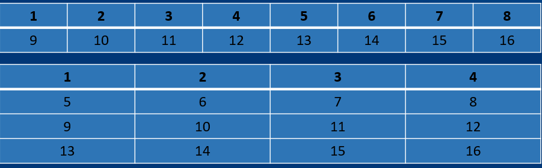

# **Array**

- ### Create array
- ### Process array
- ### Foreach loops
- ### Passing Array to Methods
- ### Return Arrays form Methods
- ### Arrays class

## 1. **Create array**

Mảng là các nhóm các biến dữ liệu giống nhau và được gọi bằng một tên chung.Có hai loại mảng: mảng một chiều và mảng đa chiều.

VD:

- Mảng một chiều
  

* Mảng đa chiều
  

- ### Mảng một chiều
  Cú pháp khai báo mảng:

```java:
 <kiểu dữ liệu>[] tên mảng
```

VD

```java:
int[] myList;
```

Cú pháp cấp phát bộ nhớ để tạo mảng:

```java:
<tên mảng> = new <kiểu dữ liệu>[Kích cỡ mảng]
```

VD

```java:
int[] myList = new int[10];
```

Cú pháp rút gọn hơn:

```java:
<kiểu dữ liệu>[]<tên mảng> = new <kiểu dữ liệu>[kích cỡ mảng];

```

Ví dụ

```java:
Double mylist = new Double[10];
```

Cú pháp khởi tạo cho mảng:

```java:
<kiểu dữ liệu>[]<tên mảng> = {<giá trị>,...}
```

Ví dụ

```java:

int[] myList = {1,2,5,5,3,5};

```

Mảng đa chiều:

Cũng như mảng một chiều dùng để lưu các giá trị có nét tương đồng. Mảng đa chiều sẽ tăng số chiều lưu trữ lên nhiều hơn, hay còn gọi là ma trận.

Cú pháp khai báo:

```java:
<kiểu dữ liệu> [][] <tên mảng> = new <kiểu dữ liệu> [kích cỡ hàng][kích cỡ cột];
```

VD

```java:
int[][] myList = new int[10][10];
```

Cú pháp khởi tạo mảng:

```java:
<kiểu dữ liệu>[][]<tên mảng> = {(các giá trị hàng 1),(các giá trị hàng 2),…(các giá trị hàng n),…}
Ví dụ:  int[][] myList = {(1,2,3),(4,5,6)};
```

## 2. **Process array**

Ta thường sử dụng vòng lặp for hay for-each bở vì tất cả những phần tử trong mảng có cùng kiểu dữ liệu và kích thước của mảng đã biết.
VD:

```java:
pulic class TestArray{
    pulic static void main(String[] args){
        double[] myList = {1.9,2.9,3.5,3.4};
        for(int i = 0;i<myList.length;i++>){
            System.out.println(myList[i] + " ");
        }
        double total = 0;
        for (int i = 0 ; i<myList.lenght;i++){
            total += myList[i];
        }
          System.out.println("Total is" +  total);
        double max = myList[0];
        for(int i = 1;i < MyList.lenght;i++){
            if(myList[i] > max){
                max = myList[i];
            }
        }
    System.out.println("Max is " + max);
    }
}
```

```java:
Output :
1.9
2.9
3.4
3.5
Total is 11.7
Max is 3.5
```

## 3. **Foreach loops**

For-each là một cách duyệt mảng khác như for, while, do-while.

For-reach bắt đầu với từ khóa for như những vòng lặp thông thường.

Nó thường được sử dụng để lặp qua một mảng hay một lớp.

Trong vòng lặp; ta có thể sử dụng biến vòng lặp đã được tạo thay cho phần tử của mảng.

Để khai báo vòng lặp, ta khai báo một biến có cùng kiểu với kiểu cơ sở của mảng, tiếp theo là dấu hai chấm và cuối cùng là tên mảng.

```java:
Ví dụ:
For (dataType item: Array){
}

```

Ví dụ về việc in các phần tử trong mảng bằng For-each:

- Với vòng lặp for thông thường:

```java:
public class TestArray{
    public static void main(String[] args){
double[] myList = {1.9,2.9,3.4,3.5};
//Print all the array elemets
for(int i = 0; i < myList.lenght; i++){
    System.out.println(mylist[i] + " ");
}
    }
}
```

```java:
Output :
1.9
2.9
3.4
3.5

```

```java:
public class TestArray{
    public static void main(String[] args){
        double[] myList = {1.9,2.9,3.4,3.5};
        //Print all the array elemets
        for(double element: myList){
        System.out.println(element);
        }
    }
}
```

```java:
Output :
1.9
2.9
3.4
3.5

```

## 4. **Passing Array to Methods**

### Cấu trúc để truyền mảng vào phương thức

```java:
method_name(array):
```

Trong đó :

_method_name_ là phương thức chúng ta cần truyền giá trị của mảng vào.

_array_ là mảng cần truyền vào phương thức.

Ví dụ

```java:
public class test{
    public static int[] Sum(int[] array){
        int Sum = 0;
        for(int i = 0; i < array.length ;i++){
            Sum += array[i];
        }
        return Sum ;
    }

    public static void main(Stirng[] args){
        int[] demo = {1,2,3,10,2,5,23};
        //Cách 1:
        System.out.println("Sum = " + Sum(demo));
        //Cách 2
        System.out.println("Sum = " + Sum(new int[]{10,20,30,40,50,60,70,80}));
    }
}
```

```java:
Output:
Sum1 = 46
Sum2 = 360

```

## 5. **Return an Array from a Method**

Chúng ta có thể trả về giá trị của mảng từ phương thức

VD:

```java:
import java.util.*;
public class Main
{
public static String[] return_Array() {

       String[] ret_Array = {"Java", "C++", "Python", "Ruby", "C"};

      return ret_Array;
   }

public static void main(String args[]) {

     String[] str_Array = return_Array();
     System.out.println("Array returned from method:" + Arrays.toString(str_Array));
    }
}
```

```java:
Output:

Array returned from method:[Java, C++, Python, Ruby, C]

```

## 6. **Array class**

Để sử dụng lớp Array chúng ta cần khai báo lớp :

```java:
import java.util.Arrays;
```

Cú pháp để sử dụng các phương thức trong lớp Arrays:

```
Arrays.<function name>;
```

Các phương thức trong lớp Arrays:

- toString()
- sort()
- binarySearch()
- ...

## Methods toString()

Dùng để hiển thị tất cả các phần tử trong mảng

```java:
 public class toString{
     public static void main(String[] args){
         int[] array = {5,7,2,7,14,34,1};
         System.out.println(Arrays.toString(array));

     }
 }
```

```java:
Output:
[5, 7, 2, 7, 14, 34, 1
```

## Methods sort()

Dùng để sắp xếp các phần tử theo thứ tự tăng dần

Phương thức này dùng Quicksort

```java:
 public class sort{
     public static void main(String[] args){
         int[] array = {5,7,2,7,14,34,1};
         Array.sort(array);
         System.out.println(Arrays.toString(array));

     }
 }
```

```java:
Output:
[1, 2, 5, 7, 7, 14, 34]

```

## Methods binarySearch()

Phương thức binarySearch() được sử dụng để tìm vị trí của phần tử trong mảng bằng phương thức tìm kiếm nhị phân (binary search). Các phần tử trong mảng phải được sắp xếp trước khi gọi phương thức này.

```java:
 public class binarySearch{
     public static void main(String[] args){
         int[] array = {5,7,2,7,14,34,1};
         Array.sort(array);
         System.out.println(Arrays.toString(array));

     }
 }
```

```java:
Output:
[1, 2, 5, 7, 7, 14, 34]
```
